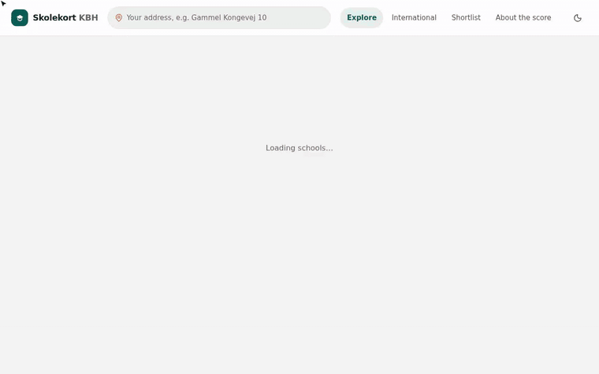

# Skolekort KBH

**Live: https://mhaegeman.github.io/kbh-folkeskole-tracker/**



<sub>[Full-quality video (MP4)](docs/demo.mp4) · Example: rank schools with the Wellbeing first priority and shortlist the top two, add Gammel Kongevej 10 as home to get the district school, bike times and route, open the school's “Why 66?” and “What pupils say”, then compare the shortlist.</sub>

A school finder for Copenhagen and the 19 surrounding municipalities. It covers folkeskoler, private schools (friskoler/privatskoler) and international schools, with official Ministry statistics, a composite **Skolescore**, fees, news, a map, school districts and travel times.

## Run it

```bash
npm install
npm run dev        # http://localhost:5173
npm run build      # static site in dist/ (works from any folder / GitHub Pages)
```

## Deployment (GitHub Pages)

`.github/workflows/deploy.yml` builds the site on every push and pull request, and deploys `main` to
**https://mhaegeman.github.io/kbh-folkeskole-tracker/**. The site uses relative paths and hash routing, so it works under the Pages subpath without configuration.

| Trigger | What happens |
|---------|--------------|
| push / pull request | `npm ci && npm run build` |
| push to `main` | build, then deploy to GitHub Pages |
| 15th of every month (05:00 UTC), or **Actions → Build & deploy → Run workflow** | re-download the register, Ministry statistics and news, then build and deploy |

One-time setup on GitHub:

1. **Settings → Pages → Build and deployment → Source: GitHub Actions**.
2. **Settings → Secrets and variables → Actions → New repository secret**: `UDDSTAT_API_KEY`. It's only needed for data refreshes.

A refresh commits the updated data (`public/data/`, `data/raw/`) back to `main` as *github-actions[bot]*, then deploys it. Run `git pull` before working locally afterwards.

## Pages

| Page | What it does |
|------|--------------|
| **Explore** | The home page: school list beside a live map. Filter chips (priority, distance, type, fee, language, more), a priority picker with presets and fine-tuning, your **district school** (GeoFA skoledistrikter), walk/bike/car travel times (OSRM) and the route to the selected school, district boundaries for København & Frederiksberg. On phones the list is a sheet over the map. A **Table** view keeps the full sortable table and the grades vs. value-added scatter plot. |
| **School page** | Score panel, “Why this score?” strengths and watch-outs, exam trends against the municipality and Denmark, what pupils say, pupils per year group, costs, contact, nearby schools, and a “More detail” section with the full calculation, every trend, survey and news. |
| **International** | International and bilingual schools (European School, CIS, ISH, Rygaards, Lycée Français, Sankt Petri and others) with curriculum, languages, fees and admission notes. |
| **Shortlist** | Your starred schools side by side, grouped into practical, learning, wellbeing and families, with the better value highlighted, a like-for-like switch, “differences only”, a suggested school to add, and overlaid trend charts. |
| **About** | How the score is calculated, data sources, caveats. |

The shortlist, home address, weights, filters and theme are saved in the browser (localStorage).

## Demo video

`docs/demo/record.mjs` drives the app with Playwright and records a video; `docs/demo/encode.sh` turns it into `docs/demo.mp4` and `docs/demo.gif`. To regenerate after UI changes:

```bash
npm run build && npx vite preview --port 4391 &
npx playwright install chromium        # once
node docs/demo/record.mjs              # needs the playwright package
bash docs/demo/encode.sh               # needs ffmpeg (or FFMPEG=/path/to/ffmpeg)
```

## Data pipeline

```bash
npm run data:register   # Institutionsregisteret (instreg.stil.dk), no key needed
npm run data:stats      # api.uddannelsesstatistik.dk, needs UDDSTAT_API_KEY in .env
npm run data:news       # Bing News per school (cached in data/raw/news; --refresh to refetch)
npm run data:build      # merge everything → public/data/schools.json
npm run data:all        # all of the above
```

`.env` (git-ignored):

```
UDDSTAT_API_KEY=<your key from https://api.uddannelsesstatistik.dk>
```

### Files

- `data/raw/`: downloaded register, statistics and news. Regenerate these with the scripts.
- `data/curated/`: hand-researched data: private school fees (`fees_*.json`), international school profiles (`international.json`), municipal SFO prices (`municipal_sfo.json`), district GeoJSON, `outcomes.json` for results from non-Ministry sources (IB, European Bac, French Bac/Brevet, supervisor reports and school surveys, each with a source URL), `exam_conversions.json` for how foreign exam results become an estimated Danish-scale exam indicator, and `overrides.json` for manual corrections. Nested fields are merged, e.g. `{"147019": {"fees": {"sfoMonthly": 1470}}}`.
- `scripts/config.mjs`: the list of municipalities covered.

### Statistics fetched (per school, per school year)

Exam averages (2010/11 onward), Danish and maths exams, socio-economic reference (value added), wellbeing indicators, absence, class size, pupil numbers per grade, inclusion, qualified teaching (kompetencedækning), pupils per teacher, and transitions to youth education. Municipal and national averages are included for comparison.

## The Skolescore

Each indicator is turned into a percentile among all mainstream schools in the area, then the percentiles are combined as a weighted average. The weights are adjustable in the UI, and there are presets. Missing indicators are skipped and the remaining weights rescaled. A school needs data covering at least 45% of the weight to get a score.

**Caveat:** the Ministry does not publish wellbeing, absence or teacher-qualification figures for private schools, so their scores lean on exam results. These scores are marked ◐. Use the **Like-for-like** preset to compare public and private schools on the same indicators.

## Known gaps

- Fees are missing for 8 private schools whose websites block automated access or don't publish prices.
- Herlev and Ishøj SFO prices come from search excerpts and should be checked manually.
- Municipal international or bilingual classes in folkeskoler, and mother-tongue teaching groups, were not verified.
- Google News is unreachable from this network and GDELT rate-limited every request, so news comes from Bing only.
